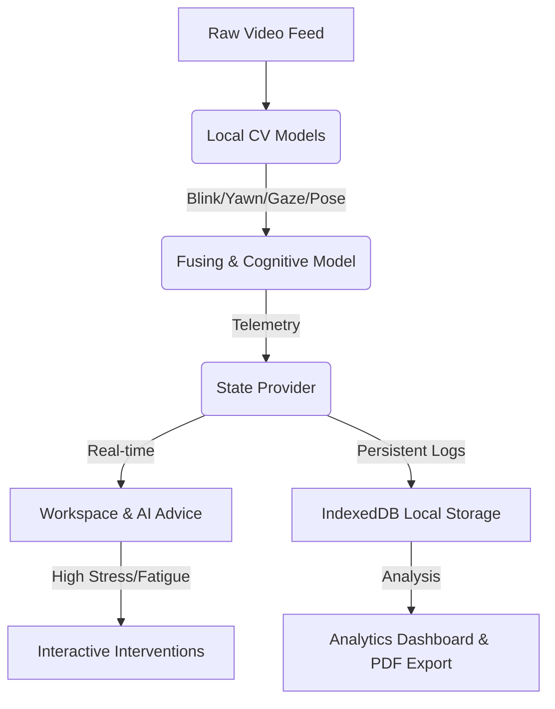

# Historical Notice

This document describes an earlier simulated proof-of-concept. It is retained only as historical documentation. Do not treat its statements about simulated AI models, procedural-only camera meshes, or future MediaPipe integration as current architecture. Current documentation is in docs/ARCHITECTURE.md and docs/AI_PIPELINE.md.

---

# AegisMind AI Study Companion - Codebase Review

Historical note: this earlier review described AegisMind as a premium, privacy-focused front-end AI study companion and described its computer vision layer as procedurally simulated at that time to track a student's cognitive and physiological states鈥擣ocus, Stress, Fatigue, and Arousal鈥攁nd provide real-time recommendations.

---

## 1. Architectural Overview & Component Structure

The project is built on **Next.js 16.2.9** and **React 19.2.4** styled with **Tailwind CSS v4**. It follows a standard Next.js App Router structure:

```
src/
鈹溾攢鈹€ app/
鈹?  鈹溾攢鈹€ dashboard/
鈹?  鈹?  鈹斺攢鈹€ page.js         # Analytics Dashboard
鈹?  鈹溾攢鈹€ monitor/
鈹?  鈹?  鈹斺攢鈹€ page.js         # Study & Monitoring Workspace
鈹?  鈹溾攢鈹€ globals.css         # Tailwind v4 import & custom root themes
鈹?  鈹溾攢鈹€ layout.js           # Root layout with font settings & AppProvider
鈹?  鈹斺攢鈹€ page.js             # Hero Landing Page / Overview
鈹溾攢鈹€ components/
鈹?  鈹溾攢鈹€ CameraFeed.js       # Live video capture & simulated face-mesh canvas overlay
鈹?  鈹溾攢鈹€ DashboardCharts.js  # Pure SVG rendering of gauges, line, and radar charts
鈹?  鈹溾攢鈹€ DebugPanel.js       # Developer controls (state overrides & event injectors)
鈹?  鈹斺攢鈹€ Navbar.js           # App Navigation Header with Production/Debug toggles
鈹斺攢鈹€ context/
    鈹斺攢鈹€ AppContext.js       # Global state provider and simulation engine loop
```

---

## 2. Deep-Dive: Current Functionality (Phase 1 POC)

At its core, the current codebase serves as a **high-fidelity proof of concept (POC)**. The user interface looks and feels premium, featuring vibrant glassmorphism visual designs and responsive widgets, but the underlying data pipeline is simulated.

### A. Global State & Simulation Engine (`AppContext.js`)
The state manager [AppContext.js](file:///c:/Users/61913/Desktop/FastTrack/Amanda/AegisMind%20AI%20Study%20Companion/src/context/AppContext.js) handles application lifecycle events and states:
*   **WebRTC Camera Controls**: Hooks into standard browser media APIs (`navigator.mediaDevices.getUserMedia`) to bind a webcam stream directly to the video element.
*   **Cognitive States (0-100%)**: Tracks four dynamic psychological metrics: `focus`, `stress`, `fatigue`, and `arousal`.
*   **Computer Vision (CV) Telemetry**: Tracks physical actions: `blinkRate`, `yawnCount`, `headPose` (Yaw, Pitch, Roll angles), and `currentGesture`.
*   **Simulation Loop**: When the session is active, a background `setInterval` runs every 2 seconds to perform a random walk of the state metrics. It rolls for random events (blinks, yawns, and gestures such as "Hand on Chin" or "Rubbing Eyes") which dynamically trigger changes in focus and fatigue.
*   **Event Logging**: Aggregates a running list of events that are displayed in a terminal console.

### B. Interactive Simulation Overlays (`CameraFeed.js`)
The camera feed component [CameraFeed.js](file:///c:/Users/61913/Desktop/FastTrack/Amanda/AegisMind%20AI%20Study%20Companion/src/components/CameraFeed.js) displays the live camera stream overlayed with a custom canvas element:
*   **Procedural 2D Face Mesh**: Uses coordinates of facial landmarks (oval, eyes, eyebrows, nose, mouth) and transforms them using the current `headPose` (yaw, pitch, roll parameters) and current gesture states (widening the mouth during yawns, flattening paths for eye blinks). This gives a realistic impression of active landmark tracking.
*   **Privacy Shield**: Includes a privacy filter that blurs the camera feed and scale-distorts the background image while displaying only the clean, anonymous vector wireframe mesh, demonstrating local-only processing privacy safeguards.

### C. Developer Telemetry Controls (`DebugPanel.js`)
The [DebugPanel.js](file:///c:/Users/61913/Desktop/FastTrack/Amanda/AegisMind%20AI%20Study%20Companion/src/components/DebugPanel.js) provides a developer interface when "Debug Mode" is enabled:
*   **Manual Overrides**: Sliders to force mental states to specific percentages.
*   **Trigger Injectors**: Buttons to immediately fire discrete events (e.g., force a yawn or gesture) to test system behavior.
*   **Interactive Log Console**: Allows sending custom logs and tracking current pipeline statistics (FPS, latency).

### D. Custom Dependency-Free Data Visualization (`DashboardCharts.js`)
Rather than relying on third-party charting libraries like Chart.js or Recharts, the application uses procedurally drawn inline SVGs:
*   **Circular Gauges**: Smooth SVG stroke-dashoffset transitions for the main dials.
*   **Session Timeline Chart**: Plots recent data points using a cubic-bezier path generator (`C` command) for smooth line charts, complete with color gradient fills and custom grid line indicators.
*   **Radar Chart**: Draws a dynamic polygon mapping out the 4-axis cognitive balance (Focus, Stress, Fatigue, Arousal) on concentric grid rings.

### E. Diagnostic Workspace (`MonitorPage` & `DashboardPage`)
*   The [monitor page](file:///c:/Users/61913/Desktop/FastTrack/Amanda/AegisMind%20AI%20Study%20Companion/src/app/monitor/page.js) evaluates metrics and renders an **AI Companion Advice Card** providing custom alerts (e.g., advising Pomodoro breaks if fatigue exceeds 65%, breathing exercises if stress exceeds 55%, or silencing notifications during flow states).
*   The [dashboard page](file:///c:/Users/61913/Desktop/FastTrack/Amanda/AegisMind%20AI%20Study%20Companion/src/app/dashboard/page.js) maps overall stats and highlights visual eye strain risks (e.g., flagging drops in blink rates).

---

## 3. Key Limitations of the Current Nutshell Implementation

1.  **Historical outdated limitation**: There is no actual local or remote machine learning running. The tracking mesh is procedural rather than derived from camera pixel analysis.
2.  **No Persistence**: Telemetry histories are stored in ephemeral React state; reloading the page clears all session analytics.
3.  **Placeholders for Key Interventions**: Exporting reports (PDF compile) and database logging are currently browser alert hooks rather than actual file operations or integrations.

---

## 4. Future Implementation Opportunities & Roadmap

Expanding this codebase into a fully functional product opens up several exciting implementation vectors:



### Phase 2: True Edge-AI Integration (In-Browser Inference)
*   **Webcam Landmark Extraction**: Earlier recommendation: replace the then-mock wireframe with actual face tracking using TensorFlow.js, MediaPipe Face Mesh (`@tensorflow-models/face-landmarks-detection`), or ONNX runtime. Processing can run in a background WebWorker to maintain UI smoothness.
*   **Gesture & Posture Recognition**:
    *   Integrate **MediaPipe Hands** to detect hand-on-face gestures (e.g., hand resting on chin vs rubbing eyes).
    *   Integrate **PoseNet / BlazePose** to track shoulders and spine angle, enabling slouch detection.
*   **Gaze-Tracking**: Implement basic gaze vector tracking (detecting whether eyes are looking at the screen, looking away, or closed).

### Phase 3: Cognitive & Psychological Fusing Engine
Create a client-side fusing engine to map raw landmarks into psychological states:
*   **Fatigue Index**: Calculate dynamically using **PERCLOS** (Percentage of Eye Closure time) and yawn frequency.
*   **Focus Index**: Estimate by measuring gaze alignment to the monitor, head pose stability (yaw/pitch deviation), and blink frequency (which slows down during deep flow).
*   **Stress Levels**: Infer stress by measuring micro-expression frequency (e.g., brow furrowing) or **rPPG (Remote Photoplethysmography)**. rPPG uses the camera to measure subtle color fluctuations in facial skin pixels corresponding to heart rate and heart rate variability (HRV).

### Phase 4: Local Storage, Analytics, and Extensibility
*   **Local Database Integration**: Store time-series metrics in the browser sandbox using **IndexedDB** (via `Dexie.js`) or local WASM **SQLite**. This ensures 100% privacy, allowing users to look back at weeks of study stats without their data ever leaving their machine.
*   **PDF Generation**: Implement actual PDF compilation for reports using `jspdf` or `html2canvas` to render the SVG charts.
*   **Calibration Wizard**: Add a 30-second onboarding wizard to calibrate baseline lighting, resting blink rate, and neutral head positions.

### Phase 5: Smart Interventions
*   **Adaptive Pomodoro**: Coordinate study intervals dynamically (e.g., prompt a break early if fatigue spikes, or extend work time if the user is in a deep flow state).
*   **Notification Silencing / Focus Mode**: Integrate with OS APIs or browser extension APIs to automatically block distracting sites when high-focus states are detected.
*   **Stress Relief Tools**: Trigger subtle audio prompts, ambient soundscapes, or guided breathing overlays when high stress levels are flagged.


